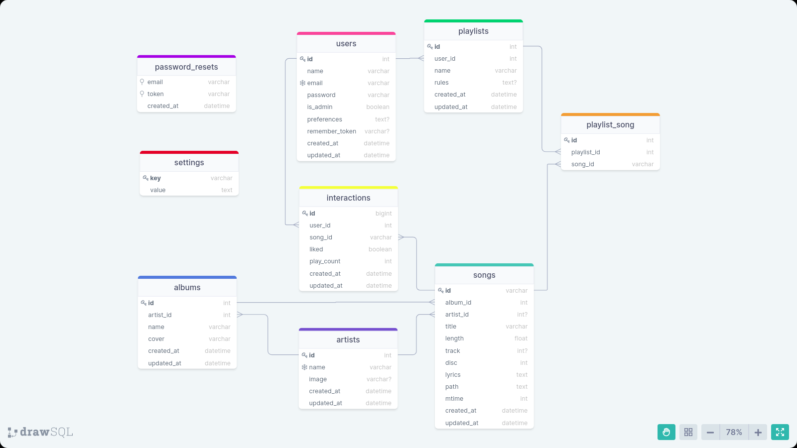

# About Project

Koel is a music streaming server. This project aims to create the database and write various scripts for different query use  cases  from users and developers.

# About Koel

**Open source music streaming server**: Started by Phan An when he ran out of storage for his music. Koel is a a simple web-based personal audio streaming service built with Laravel and Vue.

https://drawsql.app/templates/koel

